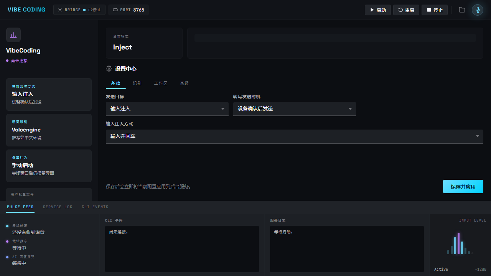

# vibecoding-voice

[English](#english) · [中文](#中文)

Follow the author on X: [@mac20777](https://x.com/intent/follow?screen_name=mac20777)

---

## English

**Voice-driven AI coding through either a wireless ESP32 e-paper device or a PC/USB microphone — speak naturally and send text to Inject, Codex, or Claude without keyboard interruption.**

> Now includes a Windows desktop app with tray mode, start-on-login, local USB microphone push-to-talk, a local settings UI, and packaged installers, so non-technical users can use it without touching a terminal.
>
> Latest Zectrix 4.2" firmware package: `v2.2.7_zectrix-s3-epaper-4.2.zip`, with long-outage reconnect fixes, offline deep sleep support, Chinese-to-English/Korean/Japanese voice translation confirmation, selectable target / Chinese+English / all-language send modes, and a DN double-click English-output shortcut.

### New: PC/USB Microphone Mode

`vibecoding-voice` now works even without the ESP32 board. The Windows desktop app can use a normal PC microphone or USB microphone as a second voice input device, then sends the audio through the same STT, translation, confirmation, and Inject / Codex / Claude pipeline.

- **Global push-to-talk**: hold `F8` anywhere on Windows to record, release to transcribe. With confirmation enabled (the default), the transcript previews in the floating overlay first — press `F9` to insert it or `F10` to discard; with immediate delivery it is inserted right away.
- **Desktop send shortcut**: press `F9` to submit the active text field, or to send pending text when confirmation is enabled; press `F10` to undo pending text.
- **English-output shortcut**: press `F7` to toggle Chinese speech -> English-only output; press it again to return to normal transcript output.
- **Configurable keys**: change record / send / undo / English-output shortcuts from the desktop app's Speech tab.
- **Same backend path**: desktop mic audio is streamed as 16 kHz PCM over WebSocket, just like the board firmware, so existing STT and translation settings still apply.
- **Xiaomi voice remote input (Windows)**: use the paired remote as a push-to-talk mSBC microphone through USBPcap; see [the Windows remote guide](docs/xiaomi-remote-windows.md) and [field notes / adaptation checklist](docs/xiaomi-remote-adaptation-notes.md).

### New in v2.2.7

- **PC/USB microphone input**: the Windows desktop app can now act as a local push-to-talk microphone device with global shortcuts.
- **Desktop English shortcut**: press `F7` to toggle Chinese speech -> English-only output from the Windows app.
- **DN double-click English shortcut**: on the Live page, double-click `DN` to toggle Chinese speech -> English-only output; double-click `DN` again to return to normal transcript output.
- **Multilingual voice translation**: speak Chinese and translate to English, Korean, or Japanese through DeepSeek.
- **Selectable send formats**: send only the target translation, Chinese + target language, Chinese + English, or Chinese + English + Korean + Japanese.
- **Board and desktop controls**: switch translation, target language, and send mode from either the e-paper board's Live menu or the Windows desktop Translation tab.
- **Clean output**: multilingual send output is plain text without `Chinese:` / `English:` labels, so the receiving app gets only the content you asked for.
- **Packaged hardware release**: firmware package `v2.2.7_zectrix-s3-epaper-4.2.zip` includes the updated board menu, multilingual confirmation display, and shortcut behavior.

`vibecoding-voice` is an open-source voice bridge with two input paths:

1. **Windows desktop / host bridge** (this repo) — a Node.js + Electron app that can use either a local PC/USB microphone or audio from an ESP32 device, transcribe it, optionally translate Chinese speech into English, Korean, or Japanese through DeepSeek, and either inject the text into the active Windows input field or drive a Codex / Claude Code CLI session.
2. **ESP32 firmware** (`firmware/`) — runs on supported e-paper boards such as Zectrix S3 and Waveshare S3, and is intended to grow into a fully DIY ESP32-S3 hardware path as well. It handles Wi-Fi, push-to-talk recording, multilingual device-side confirmation UI, resilient LAN reconnects, offline low-power sleep, and renders live CLI output on the e-ink screen.

### Why this project is useful

- Talk to Codex, Claude Code, or any active Windows input box through a dedicated ESP32 push-to-talk device
- Speak Chinese and send polished English, Korean, Japanese, or a combined Chinese + English/Korean/Japanese block, with the board showing the Chinese original above the selected translation before you confirm
- Choose between a developer-friendly CLI flow and a normal Windows desktop app for non-technical users
- Use either the ESP32 board microphone or a PC/USB microphone from the Windows app; the desktop mic supports global press-and-hold recording shortcuts
- Keep the host bridge running in the background with tray controls, mode switching, and saved local settings
- Project AI progress, transcript confirmation, and device pairing state back onto the e-paper screen
- Recover cleanly when the desktop bridge is stopped and restarted, and preserve battery when the host stays offline

### Three working modes

- **Inject mode** (`vibe` / `vibe inject`) — injects the transcript into the active input field. This is the most compatible mode and the recommended default.
- **Codex mode** (`vibe codex`) — sends the transcript to a managed Codex CLI session.
- **Claude mode** (`vibe claude`) — sends the transcript to a managed Claude Code CLI session.

### What it looks like in practice

You hold a button on the device, speak a coding instruction, release the button, and within a second the transcribed text is sent to Claude Code or Codex. The AI agent's progress — which tools it's calling, what it wrote — streams back to the e-paper screen in real time. Your hands stay on the keyboard; the device is a voice remote for your AI coding assistant.

```
┌─────────────────────────────────────────────────┐
│  ESP32 e-paper device (LAN Wi-Fi)               │
│  ┌──────┐   PTT audio (PCM16 16kHz)             │
│  │ MIC  │──────────────────────────────────┐    │
│  └──────┘                                  ▼    │
│  ┌──────────┐   WebSocket        ┌──────────────┤
│  │ e-paper  │◄───── CLI state ───│  Host bridge │
│  │ display  │                    │  (Node.js)   │
│  └──────────┘                    └──────┬───────┘
└─────────────────────────────────────────┼───────┘
                                          │ transcript
                                          ▼
                              ┌───────────────────┐
                              │  Codex CLI  or    │
                              │  Claude Code CLI  │
                              └───────────────────┘
```

### Supported Hardware

| Board | Screen | Status |
|-------|--------|--------|
| Zectrix S3 e-paper 4.2" | 400×300 grayscale e-ink | ✅ Primary dev board |
| Waveshare ESP32-S3 e-paper 1.54" | 200×200 B/W e-ink | ✅ Supported |

Both boards use ESP32-S3 with onboard MEMS mic and push-button.

> **Planned DIY hardware**: a fully open ESP32-S3 build based on off-the-shelf modules, with a BOM, wiring guide, and hand-assembly notes so the project does not depend on a specific commercial board.

### Features

- 16 kHz mono PCM audio ingest over WebSocket
- STT via Volcengine Flash ASR or OpenAI Whisper
- Windows text injection via clipboard (Ctrl+V)
- Windows desktop app with tray icon, start on login, hidden launch, close-to-tray behavior, and packaged installer output
- Local desktop settings UI with grouped tabs for mode, speech provider, USB mic hotkey, workspace, and advanced options
- PC/USB microphone capture in the Windows app, including configurable global shortcuts for press-and-hold recording, send, and undo in confirm mode
- Managed `codex exec --json` session bridge
- Managed `claude -p --output-format stream-json` session bridge
- Optional Chinese-to-English/Korean/Japanese voice translation through DeepSeek, configurable in the desktop app and confirmed on the board as `Chinese` / selected target language before send, with send modes for target-only, Chinese + target, Chinese + English, or Chinese + English + Korean + Japanese
- **Todo List page** with local persistence and page-based voice CRUD for simple plans
- Live CLI status, prompt/reply summary, log tail, and quota snapshot projected to e-paper
- **Multi-segment accumulation** — hold BOOT to keep appending speech, UP to send, DN to undo the last segment
- Device-side confirm flow: transcript shown first, explicit action required to send
- UDP LAN host discovery — device finds the bridge automatically, no hardcoded IPs
- Robust reconnect after desktop outages — discovery uses bounded non-blocking socket waits, cleans up stale WebSocket state, and can retry without rebooting the board
- Offline low-power sleep — after a long host outage the e-paper board enters deep sleep, keeps the last screen image, wakes by BOOT, and periodically wakes for retry windows
- HMAC-SHA256 authentication for both discovery and WebSocket handshake
- NVS-persisted host pairing — reconnects to the last known server on reboot

---

### Part 1 — Host Bridge

#### Requirements

- Node.js 20 or newer
- Windows (for text injection; the server itself runs on any OS)
- Codex CLI or Claude Code CLI on your `PATH` (only for CLI session modes)
- An STT provider key:
  - Volcengine: `VOLCENGINE_APP_KEY` + `VOLCENGINE_ACCESS_KEY`
  - OpenAI: `OPENAI_API_KEY`

#### Quick Start

**1. Install**

Recommended global install:

```powershell
npm install -g @mac20777/vibecoding-voice
```

From source (development):

```powershell
npm install
```

#### Desktop App (Windows)



If you want a normal desktop app instead of a terminal window, this repo now includes an Electron wrapper with:

- system tray icon
- start on login
- hidden launch to tray
- close-to-tray background behavior
- a local settings window for `config.env`
- grouped settings tabs for basic use, speech provider, workspace, and advanced options
- local PC/USB microphone recording using the same STT, translation, and send pipeline as the board
- configurable global shortcuts in the Speech tab: hold `F8` to record and insert text, press `F9` to submit, press `F10` to undo pending text, and press `F7` to toggle English-only output
- tray icon badge changes between `中` and `英` to show normal Chinese-input mode versus English-output mode
- desktop send/undo controls for the local microphone and for transcript delivery confirmation
- live status and recent activity view
- packaged Windows installer output

From source:

```powershell
npm install
npm run desktop:dev
```

Build a Windows installer:

```powershell
npm run desktop:dist
```

The packaged app keeps the bridge running in the background, so non-technical users do not need to touch `vibe`, PowerShell, or a command prompt.

**Antivirus note (360, Windows Defender SmartScreen, etc.)**: test builds may still be unsigned. Do not disable antivirus protection or whitelist the whole installation directory. Verify the release source and published SHA-256 before allowing one exact installer. Starting with 0.5.11, the desktop app uses registered Windows hotkeys and a versioned input helper instead of a global low-level keyboard hook or runtime `PowerShell -EncodedCommand` keyboard/focus code; declining the optional USBPcap driver also skips the LocalSystem remote broker. Production releases should Authenticode-sign the installer and every bundled VibeCoding executable; signed release files can then be submitted to antivirus vendors for false-positive review.

**2. Configure**

```powershell
vibe config
```

On first run, `vibe`, `vibe codex`, and `vibe claude` will launch this setup wizard automatically if the STT keys are missing.
The wizard also lets you choose how transcripts are delivered. The recommended default is `confirm_on_device`, which keeps text on the board until you press `UP` to send.

The wizard saves user-level config to:

- Windows: `%APPDATA%\vibecoding-voice\config.env`
- macOS: `~/Library/Application Support/vibecoding-voice/config.env`
- Linux: `${XDG_CONFIG_HOME:-~/.config}/vibecoding-voice/config.env`

You can still use environment variables or a local `.env` file. A local `.env` overrides the user-level config.

Minimum config for Codex + Volcengine:

```env
STT_PROVIDER=volcengine
VOLCENGINE_APP_KEY=your-app-key
VOLCENGINE_ACCESS_KEY=your-access-key
TRANSCRIPT_DELIVERY_MODE=confirm_on_device
LAN_SHARED_SECRET=replace-with-a-long-random-secret
```

Optional voice translation can be enabled from the desktop app's Translation tab, or with:

```env
VOICE_TRANSLATION_ENABLED=1
VOICE_TRANSLATION_API_KEY=your-deepseek-api-key
VOICE_TRANSLATION_MODEL=deepseek-chat
VOICE_TRANSLATION_BASE_URL=https://api.deepseek.com
VOICE_TRANSLATION_PROMPT=Translate the user's Chinese voice transcript into the selected target language. Return only the translated text.
VOICE_TRANSLATION_TARGET_LANGUAGE=english
VOICE_TRANSLATION_SEND_MODE=target
VOICE_TRANSLATION_SEND_BILINGUAL=0
```

On the board, use the safer menu path: switch to the Live page, hold `UP`, select `Translate: On` / `Translate: Off` with `UP` / `DN`, then press `BOOT` to confirm. There is no single-click shortcut for this toggle, so accidental mode changes are less likely.
For the common "speak Chinese, output English" flow, double-click `DN` on the Live page. The first double-click enables English target-only output; the next double-click disables translation and returns to normal transcript output.
In the desktop app, press `F7` for the same English-output toggle. This shortcut is configurable from the Speech tab.
Use the adjacent `Lang: English/Korean/Japanese` and `Send: Target/CN+Target/CN+EN/All` menu items, or the desktop Translation tab, to choose the board display language and whether `UP` sends only the target translation, Chinese + target, Chinese + English, or a four-line Chinese + English + Korean + Japanese result without prefixes.
When translation is enabled, the board's confirmation screen shows `Chinese` in the upper prompt area and the selected translated language in the lower reply area.

If you're using Volcengine Ark and are not sure which recording recognition model / resource to use, start here:
[Volcengine Ark Recording Recognition](https://console.volcengine.com/ark/region:ark+cn-beijing/tts/recordingRecognition)

`vibe codex`, `vibe claude`, and `vibe` choose the send target for you. You only need `SEND_TARGET` when launching `src/server.mjs` directly.
For plain `vibe` / text injection mode, the recommended default is `TEXT_INJECTION_MODE=type_and_enter`, so the typed transcript is also submitted with Enter.

**3. Run**

```powershell
vibe codex
```

The server prints the WebSocket URL and UDP discovery address on startup. The bridge is ready as soon as you see `server ready`.

**4. Diagnose (optional)**

```powershell
vibe doctor
```

Checks CLI tools, API keys, port availability, and STT provider connectivity.

#### Command Reference

| Command | Purpose |
|---------|---------|
| `vibe` | Start in inject mode (recommended; strongest compatibility) |
| `vibe codex` | Start bridge + console in Codex mode |
| `vibe claude` | Start bridge + console in Claude Code mode |
| `vibe config` | Run the interactive setup / repair wizard |
| `vibe doctor` | Validate config, keys, CLI binaries, and ports |

#### Todo Page

The device uses page-based voice routing:

- On the `Todo` page, hold `BOOT` to speak Todo commands.
- On the `Live` page, hold `BOOT` to send speech to the current send target (`inject`, `Codex`, or `Claude`).
- Short-press `BOOT` on the `Todo` page to open the quick action menu for marking done or deleting the selected item.
- Hold `UP` to open the current page menu. Use `Go Live` / `Go Todo` to switch pages.
- Double-click `UP` to quickly switch between the `Todo` and `Live` pages.
- The page menu also includes `Reconnect host` and `Restart device`; restart is blocked while offline Todo changes are waiting to sync.

The Todo list is stored locally in the user config directory as `todo-list.json`.
Fresh installs seed a few onboarding example plans that explain core board
buttons. Once the file exists, deleting those examples keeps them deleted.
Todo page recording always dispatches on BOOT release. It intentionally bypasses
the global `confirm_on_device` transcript confirmation flow, so you do not need to
press `UP` after speaking a Todo command.

Supported Todo voice commands on the Todo page:

- `查看计划`
- `添加计划 买牛奶`
- `删除计划 2`
- `修改计划 2 改成 发版本`
- `完成计划 2`
- `取消完成计划 2`

Todo intent parsing is local-rule-first. If you enable `TODO_INTENT_PROVIDER=deepseek`,
unknown or more natural phrases such as `帮我记一下明天买牛奶` are sent to DeepSeek
only to produce a structured Todo command. The model does not run Codex/Claude and
does not execute CRUD directly. If the utterance is incomplete, the bridge asks a
follow-up question on the device, for example `计划内容是什么？`. Unanswered
follow-ups auto-cancel after `TODO_FOLLOWUP_TIMEOUT_MS`.

Console shortcuts:

- `/mode normal`
- `/mode todo`
- `/todo list`
- `/todo add <text>`
- `/todo update <index> <text>`
- `/todo delete <index>`
- `/todo toggle <index>`

#### Configuration Priority

Configuration is loaded in this order, lowest to highest priority:

1. User config file: `config.env`
2. Repo root `.env`
3. Current working directory `.env`
4. Environment variables from the current shell

This means a local `.env` in your current project overrides the saved user-level config.

#### Troubleshooting

- `vibe` says STT is not configured:
  Run `vibe config` and enter either Volcengine or OpenAI credentials.
- `vibe config` saved successfully, but old values are still used:
  Run `vibe doctor` and check whether a local `.env` is overriding the user config.
- The board sends immediately after recording, but you expected `UP` to confirm:
  Run `vibe config` and set `TRANSCRIPT_DELIVERY_MODE=confirm_on_device`, then use `vibe doctor` to check whether a local `.env` is overriding it.
- The text is injected, but Enter is not pressed automatically:
  Run `vibe config` and set `TEXT_INJECTION_MODE=type_and_enter`, then use `vibe doctor` to confirm the active value.
- The board does not reconnect after restarting the host service:
  Make sure the board firmware is also updated, not only the npm package. If the reconnect prompt appears, choose `Retry host` or `Offline Todo`; if no action is taken, the board falls back to Offline Todo. If the host IP or `LAN_DISCOVERY_HOST_ID` changed, clear pairing by holding `UP + DN` and re-enter Wi-Fi setup.
- You want different settings per project:
  Keep your default keys in `config.env`, then add a project-local `.env` only when needed.

---

### Part 2 — ESP32 Firmware

#### Option A: Flash a pre-built release

Download the latest zip from [`firmware/releases/`](firmware/releases/), unzip, and run:

```powershell
# Replace COMx with your board's serial port
python -m esptool --chip esp32s3 -p COMx -b 460800 --before default_reset --after hard_reset write_flash "@flash_args"
```

The current tested Zectrix 4.2" package is `v2.2.3_zectrix-s3-epaper-4.2.zip`.
It also includes `merged-binary.bin` for single-file flashing:

```powershell
python -m esptool --chip esp32s3 -p COMx -b 460800 --before default_reset --after hard_reset write_flash 0x0 merged-binary.bin
```

#### Option B: Build from source

Requires ESP-IDF v5.5.

```powershell
cd firmware
# Windows (auto-detects Espressif toolchain at D:\Espressif)
.\build_windows.ps1 -Flash -Port COMx
```

#### Firmware Configuration

The firmware is pre-configured for LAN discovery mode. The only value you **must** set before building is the shared secret:

In `firmware/sdkconfig` (or via `idf.py menuconfig → LAN Mic`):

```
CONFIG_LAN_SHARED_SECRET="your-secret-here"
```

Set the same value in the host bridge config. Any of these is fine:

- run `vibe config`
- set `LAN_SHARED_SECRET` in a local `.env`
- export `LAN_SHARED_SECRET` in your shell

Example:

```env
LAN_SHARED_SECRET=your-secret-here
```

> **Security**: Never commit the secret to git. Generate a long random hex string (`openssl rand -hex 32`).

#### First Boot

1. Power on the device. It enters **Wi-Fi config AP mode** automatically on first boot.
2. The e-paper screen shows the AP SSID, password, and `http://192.168.4.1`.
3. Connect to that AP from a phone or laptop and open the config page.
4. Enter your Wi-Fi credentials and save.
5. The device reboots, connects to your Wi-Fi, discovers the bridge via UDP, and shows **Ready** on screen.

To re-enter config mode later: hold **UP + DOWN** until the screen clears.

#### Board Notes

- Use the provided flashing flow in `firmware/build_windows.ps1` when possible. The post-flash reset mode matters on this board.
- If you are validating the very first boot after flashing, test it once before attaching a serial monitor. Opening the monitor can trigger an extra USB reset and hide the original behavior.
- If the board behaves differently after flashing vs. after a later USB reset, check the reset path first before assuming the reconnect logic is broken.
- Maintainer-only bring-up notes and regression checks are documented in `CONTRIBUTING.md`.

---

### Device Button Reference

| Button | Connection state | Action |
|--------|-----------------|--------|
| Hold UP | Idle on Todo / Live page | Open the current page menu |
| BOOT short press | Idle on Todo page | Open quick actions: mark done or delete selected |
| Hold BOOT | Connected on Todo page | Record a Todo command |
| Hold BOOT | Connected on Live page | Record a live coding speech segment |
| BOOT (release) | Awaiting confirm | Append another segment to pending transcript |
| UP click | Awaiting confirm | Send accumulated transcript to CLI |
| DN click | Awaiting confirm | Undo last segment (cancel all if only one left) |
| UP / DN click | Idle on Todo page | Move Todo selection |
| UP / DN click | Page menu open | Move menu selection with wrap-around |
| UP double click | Idle on Todo / Live page | Toggle Todo / Live page |
| DN double click | Idle on Live page | Toggle Chinese speech -> English-only output |
| Hold UP + DN | Any | Re-enter Wi-Fi setup mode |

Screen footer shows `BOOT Add · UP Send · DN Undo` when a transcript is pending.

---

### Configuration Reference

#### STT

| Variable | Default | Description |
|----------|---------|-------------|
| `STT_PROVIDER` | auto-detect | `volcengine` or `openai` |
| `STT_TIMEOUT_MS` | `15000` | Hard recognition deadline; aborts a stuck request and closes the overlay |
| `VOLCENGINE_APP_KEY` | — | Volcengine app key |
| `VOLCENGINE_ACCESS_KEY` | — | Volcengine access key |
| `VOLCENGINE_RESOURCE_ID` | `volc.bigasr.auc_turbo` | ASR resource ID |
| `VOLCENGINE_LANGUAGE` | `zh-CN` | Recognition language |
| `OPENAI_API_KEY` | — | OpenAI API key |
| `OPENAI_TRANSCRIBE_MODEL` | `whisper-1` | Transcription model |
| `OPENAI_TRANSCRIBE_LANGUAGE` | — | e.g. `zh` |

#### Network

| Variable | Default | Description |
|----------|---------|-------------|
| `LAN_VOICE_PORT` | `8765` | WebSocket port |
| `LAN_DISCOVERY_ENABLED` | `1` | Enable UDP host discovery |
| `LAN_DISCOVERY_PORT` | `8766` | UDP discovery port |
| `LAN_DISCOVERY_HOST_ID` | — | Stable host ID (for multi-bridge LAN) |
| `LAN_SHARED_SECRET` | — | HMAC auth secret (**strongly recommended**) |
| `LAN_AUTH_WINDOW_SEC` | `300` | Timestamp freshness window in seconds |

#### Send Target

| Variable | Default | Description |
|----------|---------|-------------|
| `SEND_TARGET` | `text_injector` | `text_injector`, `codex_exec`, or `claude_code` |
| `TRANSCRIPT_DELIVERY_MODE` | `confirm_on_device` | `immediate` or `confirm_on_device` |
| `TEXT_INJECTION_MODE` | `type_and_enter` | `type_only` or `type_and_enter` |

#### Todo Intent

| Variable | Default | Description |
|----------|---------|-------------|
| `TODO_INTENT_PROVIDER` | `rules` | `rules` or `deepseek` |
| `TODO_INTENT_API_KEY` | — | DeepSeek API key for Todo semantic parsing |
| `TODO_INTENT_MODEL` | `deepseek-chat` | DeepSeek chat model |
| `TODO_INTENT_BASE_URL` | `https://api.deepseek.com` | OpenAI-compatible DeepSeek base URL |
| `TODO_INTENT_TIMEOUT_MS` | `8000` | Todo intent request timeout |
| `TODO_FOLLOWUP_TIMEOUT_MS` | `30000` | Auto-cancel timeout for incomplete Todo follow-ups |

#### Voice Translation

| Variable | Default | Description |
|----------|---------|-------------|
| `VOICE_TRANSLATION_ENABLED` | `0` | Translate Live page voice transcripts before confirmation/send |
| `VOICE_TRANSLATION_API_KEY` | — | DeepSeek API key; falls back to `DEEPSEEK_API_KEY` or `TODO_INTENT_API_KEY` |
| `VOICE_TRANSLATION_MODEL` | `deepseek-chat` | DeepSeek chat model |
| `VOICE_TRANSLATION_BASE_URL` | `https://api.deepseek.com` | OpenAI-compatible DeepSeek base URL |
| `VOICE_TRANSLATION_TIMEOUT_MS` | `12000` | Translation request timeout |
| `VOICE_TRANSLATION_PROMPT` | built-in | Prompt used to translate Chinese speech into the selected target language |
| `VOICE_TRANSLATION_TARGET_LANGUAGE` | `english` | Board display target: `english`, `korean`, or `japanese` |
| `VOICE_TRANSLATION_SEND_MODE` | `target` | Send mode: `target`, `bilingual` (Chinese + target), `zh_en` (Chinese + English), or `all` (Chinese + English + Korean + Japanese) |
| `VOICE_TRANSLATION_SEND_BILINGUAL` | `0` | Legacy compatibility flag; `1` maps to `VOICE_TRANSLATION_SEND_MODE=bilingual` when no explicit send mode is set |

#### CLI Session

| Variable | Default | Description |
|----------|---------|-------------|
| `CODEX_COMMAND` | `codex` | Codex CLI binary path |
| `CODEX_CWD` | `.` | Working directory for Codex |
| `CODEX_SKIP_GIT_REPO_CHECK` | — | Set `1` to pass `--skip-git-repo-check` |
| `CLAUDE_COMMAND` | auto-detect | Claude Code CLI path |
| `CLAUDE_CWD` | project root | Working directory for Claude |
| `CLAUDE_ALLOWED_TOOLS` | `Read,Edit,Write,Bash,Glob,Grep` | Pre-approved tools |
| `CLAUDE_MAX_TURNS` | `10` | Max agentic turns per prompt |
| `CLI_TIMEOUT_SEC` | `300` | Kill CLI subprocess after N seconds |

#### Debug

| Variable | Default | Description |
|----------|---------|-------------|
| `DRY_RUN_TEXT_INJECTION` | — | Set `1` to log injections without keystrokes |
| `MOCK_TRANSCRIPT` | — | Fixed transcript text, bypasses STT |
| `SAVE_DEBUG_WAV` | — | Set `1` to save each audio segment to `tmp/` |

---

### Development

```powershell
npm test                             # run all tests
node --test test/lan-auth.test.mjs   # run a single test file
node scripts/mock-client.mjs         # simulate a device connection
```

Debug workflow (source mode): `MOCK_TRANSCRIPT=hello world DRY_RUN_TEXT_INJECTION=1 node src/server.mjs`

Todo mode smoke test example:

```powershell
node scripts/console.mjs
/mode todo
/todo add buy milk
/todo list
```

---

### Security and Privacy

- Keep `.env` local — it is git-ignored and must never be committed.
- Always set `LAN_SHARED_SECRET` on a shared or untrusted LAN.
- Audio is sent to the configured STT provider; review provider data retention and privacy terms before use in sensitive environments.
- Codex may store session history under `~/.codex/`.
- Text injection temporarily uses the clipboard and restores the previous content when possible.

---

## 中文

**通过无线 ESP32 电子墨水设备，或者直接通过电脑/USB 麦克风，实现语音驱动的 AI 编程——无需中断键盘，按键说话即可。**

> 现在已经带有 Windows 桌面版：支持托盘、自启动、本机 USB 麦克风按住说话、本地设置界面和安装包，普通用户不用碰命令行也能直接用。
>
> 最新 Zectrix 4.2" 固件包：`v2.2.7_zectrix-s3-epaper-4.2.zip`，包含长时间断线后的自动重连修复、离线低功耗休眠、中文语音转英语/韩语/日语的板端确认、只发目标语言 / 中英 / 中英韩日发送模式切换，以及 DN 双击英文输出快捷开关。

### 新增：PC/USB 麦克风输入

现在即使没有 ESP32 板子，也可以直接使用 `vibecoding-voice`。Windows 桌面版可以把普通电脑麦克风或 USB 麦克风作为第二种语音输入设备，录到的音频会进入同一套语音识别、翻译、确认和 Inject / Codex / Claude 发送链路。

- **后台全局按住说话**：在 Windows 任意窗口按住 `F8` 录音，松开后自动转写。确认模式（默认）下转写先在悬浮窗预览，按 `F9` 上屏、`F10` 撤销；立即模式下松开即直接输入到当前文本框。
- **桌面发送快捷键**：按 `F9` 提交当前文本框；开启确认模式时，`F9` 发送待确认文本，`F10` 撤销。
- **英文输出快捷键**：按 `F7` 切换到“中文说话，只输出英文”；再次按 `F7` 回到普通转写输出。
- **快捷键可配置**：录音 / 发送 / 撤销 / 英文输出快捷键都可以在桌面端“识别”页修改。
- **复用同一套后端**：桌面麦克风音频同样以 16 kHz PCM 通过 WebSocket 发送，和板子固件走同一套 STT 与翻译配置。
- **Windows 小米语音遥控器输入**：把已配对的遥控器作为按住说话的 mSBC 麦克风使用，配置见 [Windows 遥控器指南](docs/xiaomi-remote-windows.md)；协议证据、踩坑记录与新型号适配步骤见 [实机适配记录](docs/xiaomi-remote-adaptation-notes.md)。

### v2.2.7 更新内容

- **PC/USB 麦克风输入**：Windows 桌面版现在可以作为本地按住说话麦克风设备，并支持后台全局快捷键。
- **桌面端英文快捷开关**：按 `F7` 可从 Windows 桌面端切换“中文说话，只输出英文”。
- **DN 双击英文快捷开关**：Live 页面空闲时，双击 `DN` 切换到“中文说话，只输出英文”；再次双击 `DN` 关闭翻译，回到普通转写输出。
- **多语言语音翻译**：中文说话，经 DeepSeek 翻译成英语、韩语或日语。
- **可选发送格式**：可以只发送目标语言，也可以发送中文 + 目标语言、中文 + 英语，或中文 + 英语 + 韩语 + 日语。
- **板子和桌面端都能切换**：电子墨水屏设备的 Live 菜单和 Windows 桌面端“翻译”页都可以切换翻译开关、目标语言和发送格式。
- **输出更干净**：多语言发送内容不再带 `Chinese:` / `English:` 这类前缀，接收端只会拿到纯文本内容。
- **已打包硬件版本**：`v2.2.7_zectrix-s3-epaper-4.2.zip` 固件包已包含新的板端菜单、多语言确认界面和快捷键行为。

`vibecoding-voice` 是一个支持两种语音输入路径的开源项目：

1. **Windows 桌面端 / 主机桥接服务**（本仓库）— 运行在你电脑上的 Node.js + Electron 应用。它既可以直接采集电脑/USB 麦克风，也可以通过 WebSocket 从 ESP32 设备接收按键说话（PTT）音频，调用语音识别将其转写，也可以通过 DeepSeek 把中文语音翻译成英语、韩语或日语，然后注入 Windows 当前输入框，或者驱动 Codex / Claude Code CLI 会话。
2. **ESP32 固件**（`firmware/` 目录）— 可运行在 Zectrix S3、Waveshare S3 这类已支持的电子墨水屏开发板上，后续也会补一个完全 DIY 的 ESP32-S3 硬件方案。负责 Wi-Fi 连接、按键录音、设备端多语言确认界面、可靠的局域网重连、离线低功耗休眠，并将 CLI 实时输出渲染到电子墨水屏上。

### 这个项目现在能解决什么问题

- 用一个独立的 ESP32 按键语音设备，把指令发给 Codex、Claude Code，或者直接发到 Windows 当前输入框
- 可以中文说，发送英语、韩语、日语，或者一次发送中文 + 英语/韩语/日语；设备确认页上半区显示中文原文，下半区显示选中的译文
- 同时兼容开发者工作流和普通用户工作流：既可以用 CLI，也可以用桌面版
- 既可以用 ESP32 板载麦克风，也可以直接用 Windows 桌面版采集电脑/USB 麦克风；桌面麦克风支持后台全局按住录音快捷键
- 主机桥接服务可以常驻后台，通过托盘、模式切换和本地设置页来管理
- 设备端不仅能说话输入，还能在电子墨水屏上看到 AI 执行进度、转写确认和连接状态
- 电脑服务关闭后再启动，设备可以自动恢复连接；电脑长时间关机或服务停止时，设备会进入低功耗休眠以保护电量

### 三种工作模式

- **注入模式**（`vibe` / `vibe inject`）— 将转写文本直接注入当前输入框，兼容性最强，推荐优先使用。
- **Codex 模式**（`vibe codex`）— 将转写文本发送到托管的 Codex CLI 会话。
- **Claude 模式**（`vibe claude`）— 将转写文本发送到托管的 Claude Code CLI 会话。

### 实际效果

按住设备上的按键，说出一条编程指令，松开按键，不到一秒钟，转写后的文字就会发送给 Claude Code 或 Codex。AI 代理的执行进度——调用了哪些工具、写了什么代码——实时回传并显示在电子墨水屏上。你的手还在键盘上；这个设备就是你 AI 编程助手的语音遥控器。

```
┌─────────────────────────────────────────────────┐
│  ESP32 电子墨水屏设备（局域网 Wi-Fi）              │
│  ┌──────┐   PTT 音频（PCM16 16kHz）              │
│  │ 麦克风 │──────────────────────────────────┐   │
│  └──────┘                                  ▼   │
│  ┌──────────┐   WebSocket        ┌──────────────┤
│  │ 电子墨水屏 │◄─── CLI 状态回传 ──│  主机桥接服务 │
│  └──────────┘                    └──────┬───────┘
└─────────────────────────────────────────┼───────┘
                                          │ 转写文本
                                          ▼
                              ┌───────────────────┐
                              │  Codex CLI  或    │
                              │  Claude Code CLI  │
                              └───────────────────┘
```

### 支持的硬件

| 开发板 | 屏幕 | 状态 |
|--------|------|------|
| Zectrix S3 e-paper 4.2" | 400×300 灰度电子墨水 | ✅ 主要开发板 |
| Waveshare ESP32-S3 e-paper 1.54" | 200×200 黑白电子墨水 | ✅ 已支持 |

两款板子均采用 ESP32-S3，板载 MEMS 麦克风和按键。

> **后续 DIY 方案**：补一个完全开源的 ESP32-S3 方案，基于通用模块和手工连线，提供 BOM、接线说明和装配笔记，尽量不依赖特定商业开发板。

### 功能特性

- 通过 WebSocket 接收 16kHz 单声道 PCM 音频
- 语音识别支持火山引擎闪速 ASR 或 OpenAI Whisper
- 通过剪贴板（Ctrl+V）注入 Windows 文本
- 带 Windows 桌面版：支持托盘图标、开机自启、隐藏启动、关闭后驻留托盘和安装包
- 带本地设置界面：按“基础 / 识别 / 工作区 / 高级”分组管理配置，也可以设置 USB 麦克风录音、发送、撤销和英文输出快捷键
- 托盘图标会在 `中` / `英` 之间切换，提示当前是普通中文输入模式还是英文输出模式
- Windows 桌面版可直接采集电脑/USB 麦克风，并在设备确认模式下提供桌面发送/撤销按钮和全局快捷键
- 托管 `codex exec --json` 会话
- 托管 `claude -p --output-format stream-json` 会话
- 可选中文转英语/韩语/日语翻译：中文语音先经 DeepSeek 翻译，桌面端可配置提示词，板子上以 `Chinese` / 目标语言双区确认，可切换只发目标语言、中 + 目标、中英，或中英韩日一起发送
- **Todo List 页面**：本地持久化待办，按当前页面决定语音进入 Todo 还是 Live coding
- 将 CLI 状态、提示/回复摘要、日志末行、配额快照实时投影到电子墨水屏
- **多段语音累积** — 按住 BOOT 持续追加语音片段，UP 发送，DN 撤销上一段
- 设备端确认流程：先显示转写内容，主动操作后才发送
- UDP 局域网主机自动发现 — 设备自动找到桥接服务，无需写死 IP
- 长时间断线后的可靠重连 — discovery 使用有超时边界的非阻塞 socket 等待，清理旧 WebSocket 状态，不需要重启板子也能继续重试
- 离线低功耗休眠 — 主机长时间不可用后，电子墨水屏设备会进入 deep sleep，保留最后一屏，BOOT 可立即唤醒，并定期短暂唤醒重试连接
- 发现回复和 WebSocket 握手均采用 HMAC-SHA256 签名认证
- NVS 持久化主机配对信息 — 重启后自动重连上次配对的服务器

---

### 第一部分 — 主机桥接服务

#### 环境要求

- Node.js 20 或更高版本
- Windows（文本注入功能需要；服务本身可在任何平台运行）
- Codex CLI 或 Claude Code CLI 已在 `PATH` 中（使用 CLI 会话模式时需要）
- 语音识别密钥（二选一）：
  - 火山引擎：`VOLCENGINE_APP_KEY` + `VOLCENGINE_ACCESS_KEY`
  - OpenAI：`OPENAI_API_KEY`

#### 快速开始

**1. 安装**

推荐直接全局安装：

```powershell
npm install -g @mac20777/vibecoding-voice
```

如果你是在源码仓库里开发：

```powershell
npm install
```

#### Windows 桌面版


如果你不想让普通用户面对命令行，现在仓库里已经带了一个 Electron 桌面壳，支持：

- 托盘图标
- 开机自启
- 登录后隐藏启动到托盘
- 关闭窗口后最小化到托盘
- 本地设置窗口，直接编辑 `config.env`
- 按标签页分组的设置中心
- 本机电脑/USB 麦克风录音，复用和板子相同的语音识别、翻译和发送链路
- 在“识别”页设置全局快捷键，默认后台也可按住 `F8` 录音并输入文字，按 `F9` 提交，按 `F10` 撤销待确认文本
- 设备确认模式下，也可以在桌面端点击发送或撤销
- 最近活动和服务状态面板
- 打包成 Windows 安装包

源码运行：

```powershell
npm install
npm run desktop:dev
```

构建 Windows 安装包：

```powershell
npm run desktop:dist
```

这样用户看到的是常规桌面软件，而不是 PowerShell 或命令行窗口。

**杀毒软件提示（360、Windows SmartScreen 等）**：测试安装包仍可能没有代码签名。不要关闭杀毒软件，也不要把整个安装目录加入白名单；只应在确认发布来源和 SHA-256 后放行对应的单个安装包。从 0.5.11 起，桌面程序改用 Windows 注册快捷键和带固定名称、版本信息的输入辅助程序，不再使用全局低级键盘钩子，也不再用运行时 `PowerShell -EncodedCommand` 承载键盘/焦点逻辑；如果拒绝可选的 USBPcap 驱动，也不会再注册 LocalSystem 遥控器服务。正式发布时仍应给安装包和所有自研可执行文件做 Authenticode 签名，并把最终签名版本提交杀毒厂商做误报复核。

**2. 配置**

```powershell
vibe config
```

首次运行 `vibe`、`vibe codex` 或 `vibe claude` 时，如果缺少语音识别密钥，会自动弹出这个配置向导。
向导也会让你选择“转写发送模式”。推荐默认值是 `confirm_on_device`，也就是先在板子上确认，再按 `UP` 发送。

向导会把用户级配置保存到：

- Windows：`%APPDATA%\vibecoding-voice\config.env`
- macOS：`~/Library/Application Support/vibecoding-voice/config.env`
- Linux：`${XDG_CONFIG_HOME:-~/.config}/vibecoding-voice/config.env`

你仍然可以继续使用环境变量或当前目录下的 `.env` 文件；本地 `.env` 的优先级更高。

使用 Codex + 火山引擎的最简配置：

```env
STT_PROVIDER=volcengine
VOLCENGINE_APP_KEY=你的-app-key
VOLCENGINE_ACCESS_KEY=你的-access-key
TRANSCRIPT_DELIVERY_MODE=confirm_on_device
LAN_SHARED_SECRET=替换为一个足够长的随机密钥
```

中文翻译可以在桌面端“翻译”页开启，也可以用环境变量配置：

```env
VOICE_TRANSLATION_ENABLED=1
VOICE_TRANSLATION_API_KEY=你的-deepseek-api-key
VOICE_TRANSLATION_MODEL=deepseek-chat
VOICE_TRANSLATION_BASE_URL=https://api.deepseek.com
VOICE_TRANSLATION_PROMPT=Translate the user's Chinese voice transcript into the selected target language. Return only the translated text.
VOICE_TRANSLATION_TARGET_LANGUAGE=english
VOICE_TRANSLATION_SEND_MODE=target
VOICE_TRANSLATION_SEND_BILINGUAL=0
```

板子上也可以切换：先到 Live 页面，长按 `UP` 打开菜单，用 `UP` / `DN` 选中 `Translate: On` / `Translate: Off`，再按 `BOOT` 确认。这个开关没有做成单击快捷键，避免录音或翻页时误触。
常用的“中文说话、英文输出”流程可以直接在 Live 页面双击 `DN`：第一次双击会开启“只输出英文”，再次双击会关闭翻译，回到普通转写输出。
桌面端也可以按 `F7` 执行同样的英文输出切换，并且可以在“识别”页修改这个快捷键。
旁边的 `Lang: English/Korean/Japanese` 和 `Send: Target/CN+Target/CN+EN/All` 菜单项，或桌面端“翻译”页，可以控制板子下半区显示哪种译文，以及按 `UP` 时只发送目标语言、中 + 目标、中英，还是发送“不带前缀的四行文本”：中文、英语、韩语、日语。
翻译开启后，板子的确认页上半区标题为 `Chinese`，显示你刚说的中文原文；下半区标题为当前目标语言，显示对应译文。

如果你用的是火山引擎 Ark，但不确定该选哪个录音识别模型或 `VOLCENGINE_RESOURCE_ID`，可以从这里开始：
[火山引擎 Ark 录音识别页面](https://console.volcengine.com/ark/region:ark+cn-beijing/tts/recordingRecognition)

`vibe codex`、`vibe claude` 和 `vibe` 会自动决定发送目标。只有你直接启动 `src/server.mjs` 时，才需要自己设置 `SEND_TARGET`。
如果你用的是普通 `vibe` 文本注入模式，推荐默认值为 `TEXT_INJECTION_MODE=type_and_enter`，这样注入文字后会自动补一个回车。

**3. 启动**

```powershell
vibe codex
```

服务启动时会打印 WebSocket 地址和 UDP 发现地址。看到 `server ready` 即表示桥接服务已就绪。

**4. 诊断（可选）**

```powershell
vibe doctor
```

检查 CLI 工具、API 密钥、端口可用性和语音识别服务连通性。

#### 常用命令

| 命令 | 用途 |
|------|------|
| `vibe` | 以注入模式启动（推荐，兼容性最强） |
| `vibe codex` | 以 Codex 模式启动桥接服务和控制台 |
| `vibe claude` | 以 Claude Code 模式启动桥接服务和控制台 |
| `vibe config` | 重新运行交互式配置/修复向导 |
| `vibe doctor` | 检查配置、密钥、CLI 和端口状态 |

#### Todo 页面

设备按当前页面决定语音去向：

- 在 `Todo` 页，按住 `BOOT` 说话会进入 Todo 命令解析。
- 在 `Live` 页，按住 `BOOT` 说话会发给当前发送目标（`inject` / `Codex` / `Claude`）。
- 在 `Todo` 页，短按 `BOOT` 打开完成/删除当前待办的快捷菜单。
- 按住 `UP` 打开当前页面菜单，通过 `Go Live` / `Go Todo` 切换页面。
- 双击 `UP` 可以在 `Todo` / `Live` 页面之间快速切换。
- 页面菜单也包含 `Reconnect host` 和 `Restart device`；如果有离线 Todo 变更待同步，会阻止重启。

Todo 列表保存在用户配置目录下的 `todo-list.json`。新用户首次没有该文件时，
会自动加入几条介绍板子常用按键的示例计划；文件创建后，用户删掉示例也不会反复出现。
在 Todo 页，录音会在松开 BOOT 后直接发送并执行，刻意绕过全局
`confirm_on_device` 转写确认流程，所以说完 Todo 命令后不需要再按 `UP` 发送。

Todo 页支持的语音命令：

- `查看计划`
- `添加计划 买牛奶`
- `删除计划 2`
- `修改计划 2 改成 发版本`
- `完成计划 2`
- `取消完成计划 2`

Todo 意图解析会先走本地规则。如果启用 `TODO_INTENT_PROVIDER=deepseek`，
像 `帮我记一下明天买牛奶` 这样的自然说法会发送给 DeepSeek，只用于转成结构化
Todo 命令；它不会启动 Codex/Claude，也不会直接执行 CRUD。用户说得不完整时，
桥接服务会在设备上追问，例如 `计划内容是什么？`。如果超过
`TODO_FOLLOWUP_TIMEOUT_MS` 没有回答，追问会自动取消。

控制台快捷命令：

- `/mode normal`
- `/mode todo`
- `/todo list`
- `/todo add <text>`
- `/todo update <index> <text>`
- `/todo delete <index>`
- `/todo toggle <index>`

#### 配置优先级

配置按以下顺序加载，后者覆盖前者：

1. 用户配置文件 `config.env`
2. 仓库根目录 `.env`
3. 当前工作目录 `.env`
4. 当前 shell 环境变量

也就是说，如果你当前项目目录里有 `.env`，它会覆盖通过 `vibe config` 保存的用户级配置。

#### 常见问题

- 提示 STT 未配置：
  运行 `vibe config`，填写火山引擎或 OpenAI 的密钥。
- 明明已经运行过 `vibe config`，但还是用了旧值：
  运行 `vibe doctor`，检查是不是被当前目录下的 `.env` 覆盖了。
- 板子录完音就直接发了，没有等 `UP` 确认：
  运行 `vibe config`，把 `TRANSCRIPT_DELIVERY_MODE` 设为 `confirm_on_device`，再用 `vibe doctor` 看是不是被当前目录下的 `.env` 覆盖了。
- 文本已经注入了，但没有自动按回车：
  运行 `vibe config`，把 `TEXT_INJECTION_MODE` 设为 `type_and_enter`，再用 `vibe doctor` 确认当前生效值。
- 重启主机服务后板子没有自动连回：
  确认板子固件也更新了，不能只更新 npm 包。如果屏幕出现重连菜单，选择 `Retry host` 或 `Offline Todo`；如果不操作，板子会自动回到离线 Todo。如果主机 IP 或 `LAN_DISCOVERY_HOST_ID` 变过，按住 `UP + DN` 清除配对并重新配网。
- 想按项目使用不同配置：
  默认密钥放在用户级 `config.env` 里，只有少数项目再单独放本地 `.env`。

---

### 第二部分 — ESP32 固件

#### 方案 A：烧录预编译版本

从 [`firmware/releases/`](firmware/releases/) 下载最新的 zip 文件，解压后执行：

```powershell
# 将 COMx 替换为你的开发板串口号
python -m esptool --chip esp32s3 -p COMx -b 460800 --before default_reset --after hard_reset write_flash "@flash_args"
```

当前已验证的 Zectrix 4.2" 包是 `v2.2.3_zectrix-s3-epaper-4.2.zip`。
压缩包里也包含 `merged-binary.bin`，可以用单文件方式烧录：

```powershell
python -m esptool --chip esp32s3 -p COMx -b 460800 --before default_reset --after hard_reset write_flash 0x0 merged-binary.bin
```

#### 方案 B：从源码编译

需要 ESP-IDF v5.5。

```powershell
cd firmware
# Windows（自动检测 D:\Espressif 下的工具链）
.\build_windows.ps1 -Flash -Port COMx
```

#### 固件配置

固件默认已启用 UDP 自动发现。烧录前**必须**设置的只有共享密钥：

在 `firmware/sdkconfig` 中（或通过 `idf.py menuconfig → LAN Mic` 设置）：

```
CONFIG_LAN_SHARED_SECRET="你的密钥"
```

在主机桥接服务中设置相同的值即可，下面三种方式任选一种：

- 运行 `vibe config`
- 在本地 `.env` 中设置 `LAN_SHARED_SECRET`
- 在 shell 环境变量里设置 `LAN_SHARED_SECRET`

例如：

```env
LAN_SHARED_SECRET=你的密钥
```

> **安全提示**：密钥不要提交到 git。建议用 `openssl rand -hex 32` 生成一个随机十六进制字符串。

#### 首次开机

1. 开机。首次启动时设备自动进入 **Wi-Fi 配网 AP 模式**。
2. 电子墨水屏显示 AP 名称、密码和 `http://192.168.4.1`。
3. 用手机或电脑连接该热点，打开配网页面。
4. 填入家庭/办公 Wi-Fi 凭据并保存。
5. 设备重启，连上 Wi-Fi，通过 UDP 自动发现桥接服务，屏幕显示 **Ready**。

之后需要重新配网：同时按住 **UP + DOWN** 直到屏幕清除并重新进入 AP 模式。

#### 开发板注意事项

- 尽量使用 `firmware/build_windows.ps1` 里的烧录流程，这块板子的刷机后 reset 方式确实会影响行为。
- 如果你在验证“刷机后的第一次启动”，先不要急着连串口监视器。打开串口有可能额外触发一次 USB 重置，从而掩盖首启问题。
- 如果板子表现为“刚刷完不对，后来按 USB / reset 又正常”，先排查 reset 路径，不要第一时间怀疑重连逻辑。
- 更完整的 bring-up 踩坑和回归清单见 `CONTRIBUTING.md`。

---

### 设备按键说明

| 按键 | 连接状态 | 动作 |
|------|----------|------|
| 按住 UP | Todo / Live 页空闲态 | 打开当前页面菜单 |
| 短按 BOOT | Todo 页空闲态 | 打开完成/删除当前待办的快捷菜单 |
| 按住 BOOT | Todo 页已连接 | 录制一条 Todo 命令 |
| 按住 BOOT | Live 页已连接 | 录制一段 live coding 语音 |
| BOOT（松开） | 等待确认 | 继续追加一段语音到当前转写 |
| UP 单击 | 等待确认 | 发送已累积的全部转写内容给 CLI |
| DN 单击 | 等待确认 | 撤销最后一段（只剩一段时取消全部） |
| UP / DN 单击 | Todo 页空闲态 | 移动待办选中项 |
| UP / DN 单击 | 页面菜单打开时 | 循环移动菜单选中项 |
| UP 双击 | Todo / Live 页空闲态 | 快速切换 Todo / Live 页面 |
| DN 双击 | Live 页空闲态 | 切换“中文说话，只输出英文” |
| 按住 UP + DN | 任意 | 重新进入 Wi-Fi 配网模式 |

有待发送内容时屏幕底部显示：`BOOT Add · UP Send · DN Undo`

---

### 配置项说明

#### 语音识别

| 变量 | 默认值 | 说明 |
|------|--------|------|
| `STT_PROVIDER` | 自动检测 | `volcengine` 或 `openai` |
| `STT_TIMEOUT_MS` | `15000` | 识别硬超时；中止卡住的请求并自动收起悬浮窗 |
| `VOLCENGINE_APP_KEY` | — | 火山引擎 App Key |
| `VOLCENGINE_ACCESS_KEY` | — | 火山引擎 Access Key |
| `VOLCENGINE_RESOURCE_ID` | `volc.bigasr.auc_turbo` | ASR 资源 ID |
| `VOLCENGINE_LANGUAGE` | `zh-CN` | 识别语言 |
| `OPENAI_API_KEY` | — | OpenAI API 密钥 |
| `OPENAI_TRANSCRIBE_MODEL` | `whisper-1` | 转写模型 |
| `OPENAI_TRANSCRIBE_LANGUAGE` | — | 例如 `zh` |

#### 网络

| 变量 | 默认值 | 说明 |
|------|--------|------|
| `LAN_VOICE_PORT` | `8765` | WebSocket 端口 |
| `LAN_DISCOVERY_ENABLED` | `1` | 开启 UDP 自动发现 |
| `LAN_DISCOVERY_PORT` | `8766` | UDP 发现端口 |
| `LAN_DISCOVERY_HOST_ID` | — | 稳定主机标识（多桥接场景） |
| `LAN_SHARED_SECRET` | — | HMAC 认证密钥（**强烈建议设置**） |
| `LAN_AUTH_WINDOW_SEC` | `300` | 时间戳有效窗口（秒） |

#### 发送目标

| 变量 | 默认值 | 说明 |
|------|--------|------|
| `SEND_TARGET` | `text_injector` | `text_injector`、`codex_exec` 或 `claude_code` |
| `TRANSCRIPT_DELIVERY_MODE` | `confirm_on_device` | `immediate` 或 `confirm_on_device` |
| `TEXT_INJECTION_MODE` | `type_and_enter` | `type_only` 或 `type_and_enter` |

#### Todo 意图解析

| 变量 | 默认值 | 说明 |
|------|--------|------|
| `TODO_INTENT_PROVIDER` | `rules` | `rules` 或 `deepseek` |
| `TODO_INTENT_API_KEY` | — | Todo 语义解析使用的 DeepSeek API Key |
| `TODO_INTENT_MODEL` | `deepseek-chat` | DeepSeek chat 模型 |
| `TODO_INTENT_BASE_URL` | `https://api.deepseek.com` | OpenAI-compatible DeepSeek base URL |
| `TODO_INTENT_TIMEOUT_MS` | `8000` | Todo 意图解析超时时间 |
| `TODO_FOLLOWUP_TIMEOUT_MS` | `30000` | 不完整 Todo 追问的自动取消时间 |

#### 语音翻译

| 变量 | 默认值 | 说明 |
|------|--------|------|
| `VOICE_TRANSLATION_ENABLED` | `0` | 在 Live 页面发送前，把语音转写结果先翻译成目标语言 |
| `VOICE_TRANSLATION_API_KEY` | — | DeepSeek API Key；未设置时会回退到 `DEEPSEEK_API_KEY` 或 `TODO_INTENT_API_KEY` |
| `VOICE_TRANSLATION_MODEL` | `deepseek-chat` | DeepSeek chat 模型 |
| `VOICE_TRANSLATION_BASE_URL` | `https://api.deepseek.com` | OpenAI-compatible DeepSeek base URL |
| `VOICE_TRANSLATION_TIMEOUT_MS` | `12000` | 翻译请求超时时间 |
| `VOICE_TRANSLATION_PROMPT` | 内置提示词 | 控制“中文语音转目标语言”的翻译风格 |
| `VOICE_TRANSLATION_TARGET_LANGUAGE` | `english` | 板端显示目标：`english`、`korean` 或 `japanese` |
| `VOICE_TRANSLATION_SEND_MODE` | `target` | 发送模式：`target`、`bilingual`（中文 + 目标）、`zh_en`（中文 + 英语）、`all`（中文 + 英语 + 韩语 + 日语） |
| `VOICE_TRANSLATION_SEND_BILINGUAL` | `0` | 兼容旧版本的开关；未显式设置发送模式时，`1` 等价于 `VOICE_TRANSLATION_SEND_MODE=bilingual` |

#### CLI 会话

| 变量 | 默认值 | 说明 |
|------|--------|------|
| `CODEX_COMMAND` | `codex` | Codex CLI 路径 |
| `CODEX_CWD` | `.` | Codex 工作目录 |
| `CODEX_SKIP_GIT_REPO_CHECK` | — | 设为 `1` 传入 `--skip-git-repo-check` |
| `CLAUDE_COMMAND` | 自动检测 | Claude Code CLI 路径 |
| `CLAUDE_CWD` | 项目根目录 | Claude 工作目录 |
| `CLAUDE_ALLOWED_TOOLS` | `Read,Edit,Write,Bash,Glob,Grep` | 预授权工具列表 |
| `CLAUDE_MAX_TURNS` | `10` | 每次提示的最大轮数 |
| `CLI_TIMEOUT_SEC` | `300` | CLI 子进程超时秒数 |

#### 调试

| 变量 | 默认值 | 说明 |
|------|--------|------|
| `DRY_RUN_TEXT_INJECTION` | — | 设为 `1` 仅记录日志不注入按键 |
| `MOCK_TRANSCRIPT` | — | 固定转写文本，跳过语音识别 |
| `SAVE_DEBUG_WAV` | — | 设为 `1` 将每段音频保存到 `tmp/` |

---

### 开发调试

```powershell
npm test                             # 运行全部测试
node --test test/lan-auth.test.mjs   # 运行单个测试文件
node scripts/mock-client.mjs         # 模拟设备连接
```

调试工作流（源码模式）：`MOCK_TRANSCRIPT=你好世界 DRY_RUN_TEXT_INJECTION=1 node src/server.mjs`

Todo 模式冒烟示例：

```powershell
node scripts/console.mjs
/mode todo
/todo add 买牛奶
/todo list
```

---

### 安全与隐私

- `.env` 文件仅保留在本地，已加入 `.gitignore`，**绝不要提交**。
- 在共享或不受信任的局域网中必须设置 `LAN_SHARED_SECRET`。
- 音频会发送给配置的语音识别服务商，在敏感环境中使用前请确认服务商的数据留存和隐私政策。
- Codex 可能在 `~/.codex/` 下存储会话历史。
- 文本注入会临时使用剪贴板，操作完成后尽量恢复原有内容。
