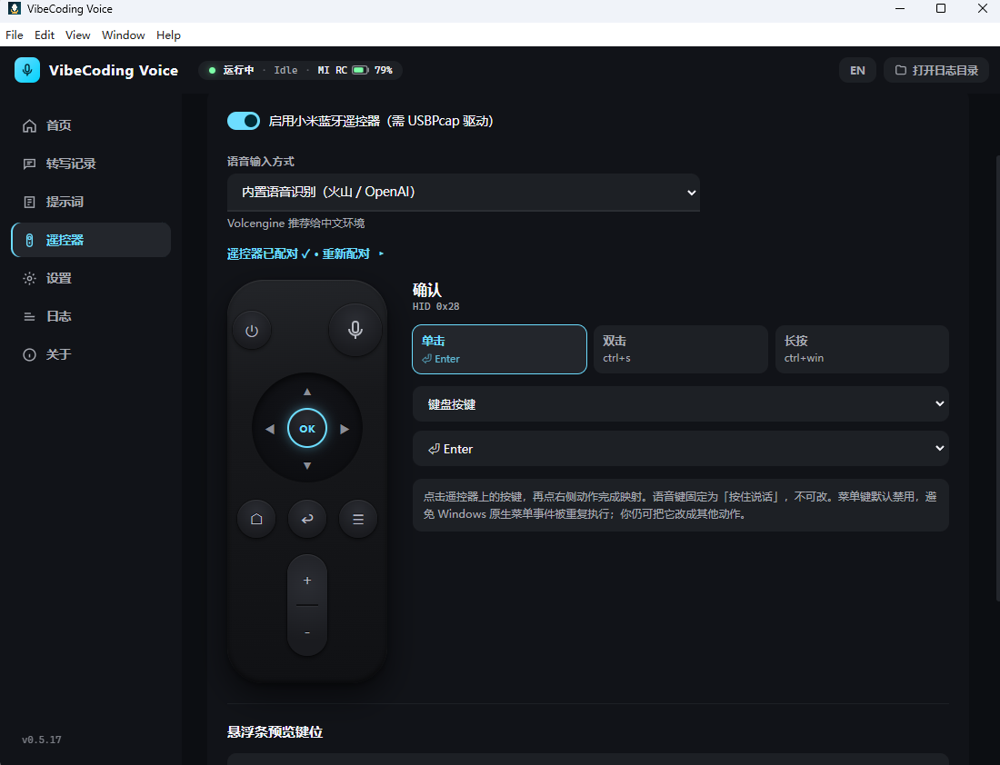

# VibeCoding Voice

把小米蓝牙语音遥控器或电脑麦克风，变成 Windows 全局“按住说话”输入器。

**按住说话，松开识别，文字直接进入当前输入框。**



## 最新功能：遥控器直连微信输入法

- **使用遥控器自己的麦克风**：按住语音键录音，松开后调用微信输入法识别。
- **不显示应用悬浮窗**：识别结果由微信输入法直接写入当前输入框。
- **配置集中在一个页面**：查看配对、连接、电量和麦克风状态，切换语音模式，设置单击、双击和长按动作。

首次使用微信模式，需要在微信输入法中把麦克风设为 `CABLE Output (VB-Audio Virtual Cable)`，再到应用的“遥控器”页确认配置。微信模式不需要 OpenAI 或火山引擎密钥。

## 主要功能

- **微信输入法模式**：遥控器和电脑 `F8` 麦克风都可以调用微信语音输入。
- **内置语音识别（默认）**：支持火山引擎和 OpenAI，可先预览再确认输入。
- **遥控器按键自定义**：单击、双击、长按可映射到按键、组合键、应用或文字。
- **多种发送目标**：输入当前文本框，或发送到 Codex / Claude 会话。
- **可选 ESP32 设备**：继续支持 ESP32 电子墨水语音终端。

## 三步开始

1. 打开 Windows 桌面版，在“遥控器”页启用并配对小米语音遥控器。
2. 选择“微信输入法”或“内置语音识别”，按页面提示完成一次配置。
3. 按住遥控器语音键说话，松开后等待文字出现；使用电脑麦克风时按住 `F8`。

### 运行最新版源码

需要 [Node.js 20+](https://nodejs.org/)：

```powershell
git clone https://github.com/mac20777/vibecoding-voice.git
cd vibecoding-voice
npm install
npm run desktop:dev
```

已发布的安装包可在 [Releases](https://github.com/mac20777/vibecoding-voice/releases) 下载；README 展示的最新功能以 `main` 分支为准。

> Windows 测试包可能尚未签名。请只从本仓库下载，不要关闭杀毒软件或全局放行安装目录。

## 使用文档

- [Windows 小米遥控器配置](docs/xiaomi-remote-windows.md)
- [遥控器型号适配记录](docs/xiaomi-remote-adaptation-notes.md)
- [Ubuntu 打包说明](docs/ubuntu-packaging.md)
- [配置模板](.env.example)
- [参与开发](CONTRIBUTING.md) · [安全说明](SECURITY.md)

<details>
<summary><strong>English</strong></summary>

VibeCoding Voice turns a Xiaomi Bluetooth voice remote or a PC microphone into a global push-to-talk input device for Windows.

### Latest: Xiaomi remote + WeChat Input Method

- **Uses the remote's microphone**: hold the voice key to record, then release it for recognition.
- **No app overlay in WeChat mode**: WeChat Input Method types directly into the focused field.
- **One remote-control page**: pairing, connection, battery, microphone status, voice mode, and button mappings.

For first-time setup, select `CABLE Output (VB-Audio Virtual Cable)` as the microphone in WeChat Input Method, then confirm the setting on the app's Remote page. No OpenAI or Volcengine key is required for WeChat mode.

### Highlights

- WeChat Input Method support for both the Xiaomi remote and the desktop `F8` microphone
- Built-in OpenAI or Volcengine speech recognition by default, with optional confirmation
- Custom click, double-click, and hold actions for remote buttons
- Text injection plus Codex / Claude session targets
- Optional ESP32 e-paper voice devices

### Quick start

1. Open the Windows app, enable the Xiaomi remote, and pair it on the Remote page.
2. Choose WeChat Input Method or built-in speech recognition and follow the one-time setup prompt.
3. Hold the remote's voice key while speaking and release it to recognize. Hold `F8` to use the PC microphone.

To run the latest source version, install [Node.js 20+](https://nodejs.org/) and run:

```powershell
git clone https://github.com/mac20777/vibecoding-voice.git
cd vibecoding-voice
npm install
npm run desktop:dev
```

Published installers are available from [Releases](https://github.com/mac20777/vibecoding-voice/releases). The newest features shown here track the `main` branch.

</details>

## 开发 / Development

```powershell
npm run doctor
npm test
```

MIT License © [mac20777](https://github.com/mac20777)
